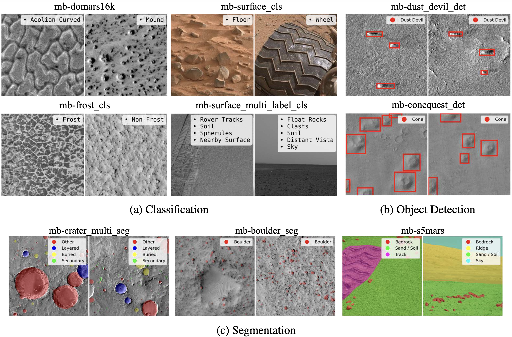

<!--
HOW TO USE IMAGES IN THIS README
================================
- Create an `assets/` folder at the repo root (next to `README.md`).
- Save your title/banner image as `assets/mars-bench-title.png`.
- Save your teaser figure as `assets/mars-bench-teaser.png`.
- Commit these images to the repo. GitHub will automatically render them here.
- If you prefer different filenames or paths, just update the `src` paths below.
-->

<p align="center">
  
</p>

<p align="center">
  <a href="https://arxiv.org/abs/2510.24010">📄 Paper</a>  | 
  <a href="https://mars-bench.github.io/">🌐 Project Website</a>  | 
  <a href="https://huggingface.co/collections/Mirali33/mars-bench-models">🤗 HuggingFace</a>  | 
  <a href="https://zenodo.org/communities/mars-bench/records">🗄️ Zenodo</a>  | 
  <a href="https://huggingface.co/spaces/Mirali33/Mars-Bench">🏆 LeaderBoard</a>  | 
  <a href="https://huggingface.co/collections/Mirali33/mars-bench-models">🤖 Baseline Models</a>
</p>

<p align="center">
  Mirali Purohit<sup>1,3</sup>, Bimal Gajera<sup>1*</sup>, Vatsal Malaviya<sup>1*</sup>, Irish Mehta<sup>1*</sup>,<br/>
  Kunal Kasodekar<sup>1</sup>, Jacob Adler<sup>2</sup>, Steven Lu<sup>3</sup>, Umaa Rebbapragada<sup>3</sup>, Hannah Kerner<sup>1</sup>
</p>

<p align="center">
  <sup>1</sup>School of Computing and Augmented Intelligence, Arizona State University, Tempe, AZ, USA<br/>
  <sup>2</sup>School of Earth and Space Exploration, Arizona State University, Tempe, AZ, USA<br/>
  <sup>3</sup>Jet Propulsion Laboratory, California Institute of Technology, Pasadena, CA, USA<br/>
  <sup>*</sup>Equal Contribution
</p>

---

## Introduction

<p align="center">
  
</p>

Mars-Bench introduces the first standardized benchmark for Mars science, covering 20 datasets across classification, segmentation, and object-detection tasks using both orbital and rover imagery. It includes a wide range of geologic features; such as craters, cones, boulders, and frost to support comprehensive evaluation.

---

## Installation

```bash
# Install the package with core dependencies
pip install -e .

# Install with development dependencies (for testing, linting, etc.)
pip install -e ".[dev]"
```

## Usage

For detailed usage examples and commands, please refer to [examples.md](examples.md).

## Configuration

MarsBench uses Hydra for configuration management. The main configuration is located in `marsbench/configs/config.yaml` with task-specific configurations in the respective subdirectories:

- `configs/model/classification/`: Classification model configurations
- `configs/model/segmentation/`: Segmentation model configurations
- `configs/model/detection/`: Detection model configurations
- `configs/data/classification/`: Classification dataset configurations
- `configs/data/segmentation/`: Segmentation dataset configurations
- `configs/data/detection/`: Detection dataset configurations
- `configs/training/`: Training hyperparameters and settings
- `configs/transforms/`: Image transformation settings
- `configs/logger/`: Logging configuration
- `configs/callbacks/`: PyTorch Lightning callback settings

Override any configuration parameter using the command line:

```bash
python -m marsbench.main task=classification model_name=resnet18 data_name=domars16k training.batch_size=64 training.optimizer.lr=0.0005
```

## Datasets

### Classification
- Atmospheric Dust Classification EDR
- Atmospheric Dust Classification RDR
- Change Classification CTX
- Change Classification HiRISE
- DoMars16k
- Frost Classification
- Landmark Classification
- Surface Classification

### Segmentation
- Boulder Segmentation
- ConeQuest Segmentation
- Crater Binary Segmentation
- Crater Multi Segmentation
- MMLS
- MarsSegMER
- MarsSegMSL
- Mask2Former
- S5Mars

### Detection
- Boulder Detection
- ConeQuest Detection
- Dust Devil Detection

## Supported Models

### Classification
- ResNet101
- Vision Transformer (ViT)
- Swin Transformer
- InceptionV3
- SqueezeNet

### Segmentation
- U-Net
- DeepLab
- DPT
- Mask2Former
- SegFormer

### Detection
- Faster R-CNN
- RetinaNet
- SSD

## Project Structure

```
marsbench/
├── marsbench/              # Main package
|   ├── configs/            # Hydra configuration files
|   ├── data/               # Dataset implementations
│   │   ├── classification/ # Classification datasets
│   │   ├── segmentation/   # Segmentation datasets
│   │   └── detection/      # Detection datasets
│   ├── models/             # Model implementations
│   │   ├── classification/ # Classification models
│   │   └── segmentation/   # Segmentation models
│   │   └── detection/      # Detection models
│   ├── training/           # Training utilities
│   ├── utils/              # Helper functions
│   └── main.py             # Entry point
├── tests/                  # Unit tests
├── examples/               # Example scripts
└── outputs/                # Generated outputs (predictions, checkpoints, logs)
```

## Development

### Adding a New Dataset

1. Create a new dataset implementation in `marsbench/data/classification/` or `marsbench/data/segmentation/`
2. Inherit from `BaseClassificationDataset` or `BaseSegmentationDataset`
3. Implement the `_load_data` method
4. Add dataset configuration in `configs/data/classification/` or `configs/data/segmentation/`
5. Register the dataset in `marsbench/data/__init__.py`

### Adding a New Model

1. Create a new model implementation in `marsbench/models/classification/` or `marsbench/models/segmentation/`
2. Inherit from `BaseClassificationModel` or `BaseSegmentationModel`
3. Implement the `_initialize_model` method
4. Add model configuration in `configs/model/classification/` or `configs/model/segmentation/`
5. Register the model in `marsbench/models/__init__.py`
