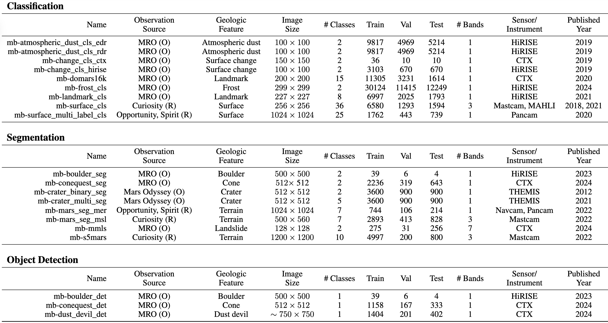

<!--
HOW TO USE IMAGES IN THIS README
================================
- Create an `assets/` folder at the repo root (next to `README.md`).
- Save your title/banner image as `assets/mars-bench-title.png`.
- Save your teaser figure as `assets/mars-bench-teaser.png`.
- Commit these images to the repo. GitHub will automatically render them here.
- If you prefer different filenames or paths, just update the `src` paths below.
-->

<p align="center">
  
</p>

<p align="center">
  <a href="https://arxiv.org/abs/2510.24010">📄 Paper</a>  | 
  <a href="https://mars-bench.github.io/">🌐 Project Website</a>  | 
  <a href="https://huggingface.co/collections/Mirali33/mars-bench-models">🤗 HuggingFace</a>  | 
  <a href="https://zenodo.org/communities/mars-bench/records">🗄️ Zenodo</a>  | 
  <a href="https://huggingface.co/spaces/Mirali33/Mars-Bench">🏆 LeaderBoard</a>  | 
  <a href="https://huggingface.co/collections/Mirali33/mars-bench-models">🤖 Baseline Models</a>
</p>

<p align="center">
  Mirali Purohit<sup>1,3</sup>, Bimal Gajera<sup>1*</sup>, Vatsal Malaviya<sup>1*</sup>, Irish Mehta<sup>1*</sup>,<br/>
  Kunal Kasodekar<sup>1</sup>, Jacob Adler<sup>2</sup>, Steven Lu<sup>3</sup>, Umaa Rebbapragada<sup>3</sup>, Hannah Kerner<sup>1</sup>
</p>

<p align="center">
  <sup>1</sup>School of Computing and Augmented Intelligence, Arizona State University, Tempe, AZ, USA<br/>
  <sup>2</sup>School of Earth and Space Exploration, Arizona State University, Tempe, AZ, USA<br/>
  <sup>3</sup>Jet Propulsion Laboratory, California Institute of Technology, Pasadena, CA, USA<br/>
  <sup>*</sup>Equal Contribution
</p>

---

## Introduction

<p align="center">
  
</p>

Mars-Bench introduces the first standardized benchmark for Mars science, covering 20 datasets across classification, segmentation, and object-detection tasks using both orbital and rover imagery. It includes a wide range of geologic features; such as craters, cones, boulders, and frost to support comprehensive evaluation.

<p align="center">
  
</p>

---

## Installation

```bash
# Install the package with core dependencies
pip install -e .

# Install with development dependencies (for testing, linting, etc.)
pip install -e ".[dev]"
```

## Usage

Mars-Bench uses a Hydra-based CLI with `marsbench.main` as the entry point:

- **Quickstart examples**: Refer to `EXAMPLES.md` for end-to-end commands for classification, segmentation, and detection, including how to select datasets and models.
- **Configs and benchmarking scripts**: Explore the `marsbench/configs/` directory for all task/model/data configurations and the `benchmark/` folder for scripts used to reproduce the paper’s experiments and figures.

### Citation

If you use ConeQuest in your research, please use the following citation:

```
@inproceedings{purohit2025marsbench,
    title={Mars-Bench: A Benchmark for Evaluating Foundation Models for Mars Science Tasks},
    author={Mirali Purohit and Bimal Gajera and Vatsal Malaviya and Irish Mehta and Kunal Sunil Kasodekar and Jacob Adler and Steven Lu and Umaa Rebbapragada and Hannah Kerner},
    booktitle={The Thirty-ninth Annual Conference on Neural Information Processing Systems Datasets and Benchmarks Track},
    year={2025},
    url={https://arxiv.org/pdf/2510.24010}
}
```

### Contact Information
Please reach out to Mirali Purohit [mpurohi3@asu.edu](mpurohi3@asu.edu), if you have any queries or issues regarding Mars-Bench.